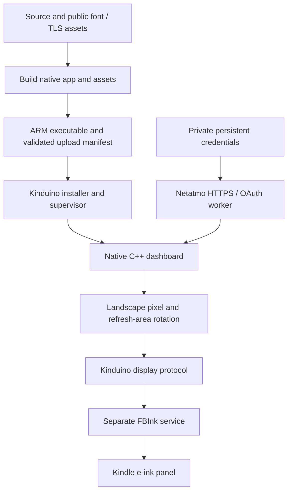

# Architecture

The native app and optional Python preview share the display design and Netatmo field mapping. They are independent implementations; the native app does not request images from Python.

## Rendering and time

`Dashboard.cpp` draws the same scene in device and host tests. The panel is physically 758 × 1024; the application renders a logical 1024 × 758 scene. `LandscapeBackend.h` converts both pixels and dirty rectangles to panel coordinates, so a partial clock update refreshes the correct physical region.

For the final USB-edge-left orientation, a logical pixel `(x, y)` maps to physical `(y, 1023 - x)`. A rectangle `(x, y, w, h)` maps to `(y, 1024 - x - w, h, w)`. Within its rotated buffer, source `(column, row)` maps to index `(w - 1 - column) * h + row`, with row stride `h`. The app leaves the system framebuffer geometry and reader orientation alone.

The clock uses the Kindle system time and POSIX Oslo daylight-saving rules. Dates before 2020 produce a clock-setting prompt. During the day it polls every 200 ms, redraws the clock at minute boundaries, and requests a full refresh every 15 minutes, on a date change, or after a time jump. A separate worker fetches Netatmo every three minutes; sensor/status changes refresh their own region. The display thread never waits for DNS, TLS or OAuth.

`NightMode` calculates the next local 07:00 with a fresh DST calculation and requests timed sleep from 23:00 onward. Its hardware adapter uses the pinned runtime's suspend API and light controls. The network worker must first acknowledge that no request or token save is in progress. A durable one-time hardware test gates the schedule; on morning wake the full screen is redrawn and suspend time advances the OAuth expiry clock. See [night mode](NIGHT-MODE.md).

## Launching and updating

The local browser button opens a fixed custom dialog already copied to the Kindle. That dialog runs `dashy/apply-landscape.sh`, the historical device filename for `native/browser-launch.sh`.

The launcher detaches the **whole update operation** before the reader interface can restart. The update then:

1. Checks the exact model, firmware, and runtime.
2. Requests a graceful stop of an existing Dashy supervisor and waits for its runtime processes to exit.
3. Removes a leftover `run/current` marker only when no runtime process remains.
4. Installs a pending upload, if present, using the runtime's own validator.
5. Imports separately staged Netatmo credentials, when present, into the app’s private writable directory.
6. Starts Dashy through the detached application launcher and saves diagnostic logs on USB storage.

Another app, an orphaned runtime process, or a stop timeout blocks the update. The code does not clear the session marker simply because reopening failed.

## Upload contract

The `.kinduino` upload contains a static ARM EABI executable, font assets, a version-2 manifest using API 2.0.0, SHA-256 hashes and sizes, and a `READY` marker. Copy `READY` last. The installer verifies the archive contents and consumes the upload when installed. Reopening with no pending upload starts the already installed app.

The packager checks ARM architecture and absence of a dynamic loader, pins the runtime checksum, and includes source and third-party notices. Host tests compile the actual runtime installation code; they do not execute the ARM program.

## Runtime and recovery boundary

Kinduino owns stopping and restoring the reader framework, input handling, the display service, and process supervision. Its framework shim holds the `com.lab126.kaf` service name. Abruptly killing pieces and immediately restarting the reader can leave the service handoff broken; Dashy requests orderly supervisor cleanup instead.

Automatic startup is opt-in. It adds its own upstart job, checks USB-accessible disable flags, and attempts launch once per boot. This path has host coverage but has not been validated through a physical reboot.

The Python preview exposes fixed display routes. The setup server separately exposes a page and an empty download with a fixed dialog header. Neither serves the repository as a file directory. The setup server defaults to loopback; bind it to the local network only while using the Kindle launcher.

## Netatmo credentials and retries

The app stores credentials and the latest refresh token in its nobody-owned `files/netatmo.json`, mode 0600. Rotation uses a temporary file, file synchronization and atomic rename before a station request. Uploads replace the executable/assets while preserving `files/`. The public TLS root is an ordinary checked asset; credentials never are.

OAuth and data parsing are independent of the transport and filesystem adapters. The worker publishes an owning snapshot under a short mutex; the UI never holds that mutex during network I/O. A rejected grant stops requests until credentials are replaced and the app restarted. An API authorization failure gets one refresh/retry. Rate limits use bounded Retry-After; network/data failures preserve the last readings with an error label. See [NETATMO.md](NETATMO.md).
